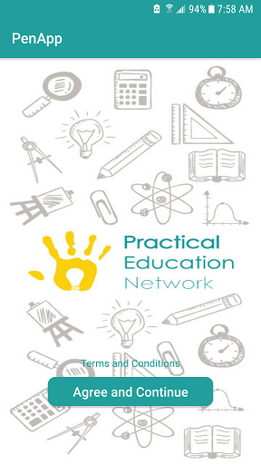
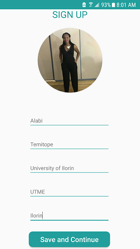
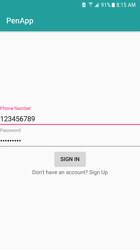
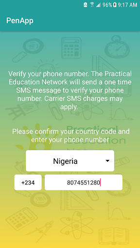
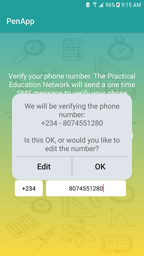
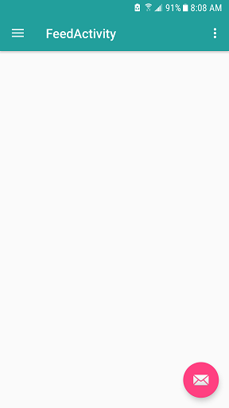

# Pen App

Is an application for Practical Education Network which core objective is to enhance engagement between 
members teachers, rank teachers who is performing optimumly in discharging its duty as tutor. 

# Still in development, collaboration will be appreciated.

# Classes which work is in progress
This project have 5 java classes
1. CreateCommentActivity
2. CreateFeedActivity
3. FeedActivity
4. MainActivity
5. PhrasesActivity
6. SigninActivity

# Layouts
This project have 7  major Layouts
1. Activity Create Comment Layout
2. Activity Feed Layout
3. Confirm Number Dialog Card
4. signin Activity
5. SignupActivity
6. App BarActivity

# Click on Google Drive Icon Below to download apk

or 
https://drive.google.com/drive/u/0/folders/1sjdMR31Q5uz0DXadGiZP-7YFkbnXNkXK

# Screenshots
&nbsp;
&nbsp;
&nbsp;
&nbsp;
&nbsp;

# Author : Alabi Temitope 
